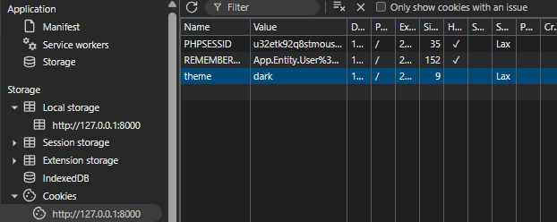
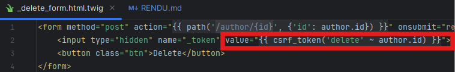
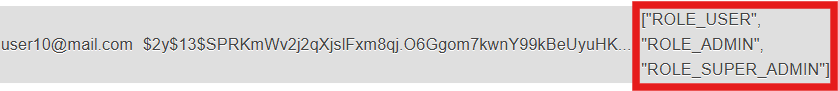
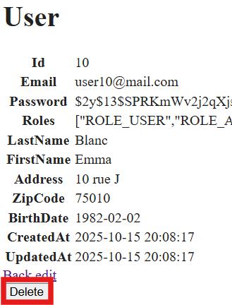
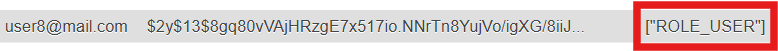
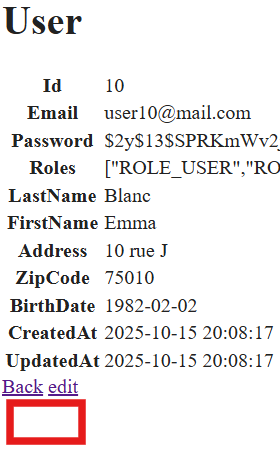

## Un screenshot de la mise en œuvre du maintien d’une authentification inférieure
  à 48h. (test avec 10 secondes)

## Un screenshot illustrant la présence du cookie (mode d’affichage « clair » ou «
   sombre »).

   
## Un screenshot illustrant la protection contre les attaques CSRF. 

- Visible avec un user ayant le rôle ADMIN et/ou SUPER_ADMIN :

- Non visible avec un user ayant le rôle USER (par défaut) :

## Une explication sur la solution trouvée pour tester les vulnérabilités potentielles des dépendances. 

Approche multi-outils : Les tests ont été réalisés en utilisant plusieurs méthodes complémentaires :

- Postman : pour envoyer des requêtes HTTP manuelles et vérifier les réponses du serveur, détecter des comportements inattendus ou des failles côté formulaire.
- Ligne de commande : utilisation de scripts et d’outils comme curl ou wget pour automatiser certains tests, simuler des attaques ou vérifier la présence de headers de sécurité.
- Exploration des chemins du site : inspection directe des URL et des endpoints de l’application pour identifier des zones sensibles et des vulnérabilités potentielles (accès non autorisé, données exposées).

- Objectif principal : identifier les vulnérabilités liées aux dépendances (bibliothèques, bundles Symfony, packages tiers) et s’assurer que toutes les protections intégrées étaient correctement configurées.

## Les difficultés rencontrées et solutions adoptées.

Erreurs dans les formulaires :

- Lors de l’ajout de nouvelles vérifications ou sécurités (ex : validation, protection CSRF), un grand nombre d’erreurs sont apparues dans les formulaires.
- Causes principales : oublis dans le code, champs manquants, ou erreurs d’attention lors de la mise en place des contrôles.
- Solution : correction progressive des formulaires en vérifiant chaque champ, ajout systématique des tokens CSRF et des contraintes de validation, et tests fréquents après chaque modification.

Complexité de certaines dépendances Symfony :

- Certaines bibliothèques ont des configurations spécifiques ou des interactions complexes avec les permissions et la sécurité.
- Solution : lecture approfondie de la documentation Symfony, utilisation des logs pour comprendre les erreurs et tests ciblés sur chaque fonctionnalité affectée.

## Un bilan des acquis, du point de vue de la sécurité des applications Web ainsi que du framework Symfony.
 
Sécurité des applications Web

- Gestion des cookies : compréhension des attributs HttpOnly, Secure, SameSite, et de leur rôle pour sécuriser les sessions.
- Validation des formulaires : apprentissage des contraintes Symfony pour sécuriser les inputs et éviter les injections ou erreurs côté serveur.
- Protection CSRF : intégration et vérification des tokens pour sécuriser toutes les actions sensibles.

Apports spécifiques au framework Symfony

- Gestion des permissions : apprentissage de l’arborescence des rôles et des droits (ROLE_USER, ROLE_ADMIN) et de leur application sur les routes et contrôleurs.
- Séparation des accès : compréhension de qui peut accéder à quoi et mise en pratique de la logique de sécurité intégrée à Symfony.
- Structuration et organisation du code : découverte des bonnes pratiques de Symfony pour structurer les contrôleurs, services et formulaires de manière sécurisée et maintenable.
- Conclusion : Ces exercices ont permis de renforcer la sécurité de l’application et d’acquérir une meilleure maîtrise de Symfony, notamment sur la gestion des dépendances, des formulaires et des permissions.
